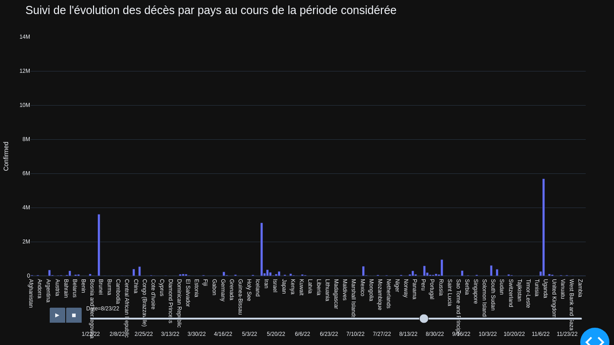
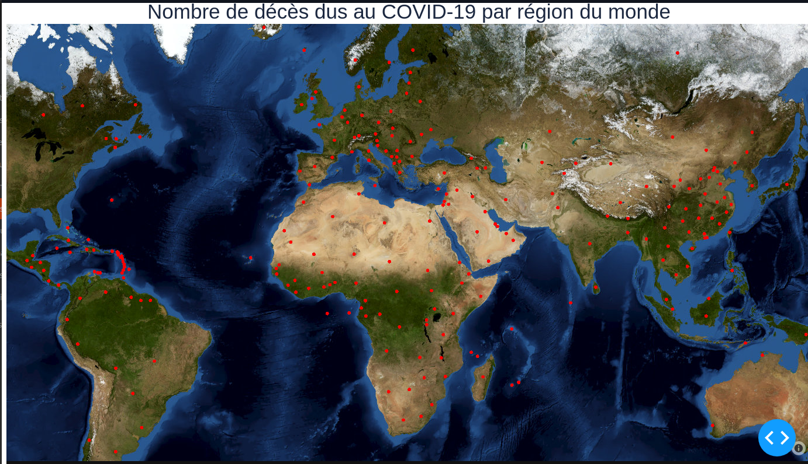
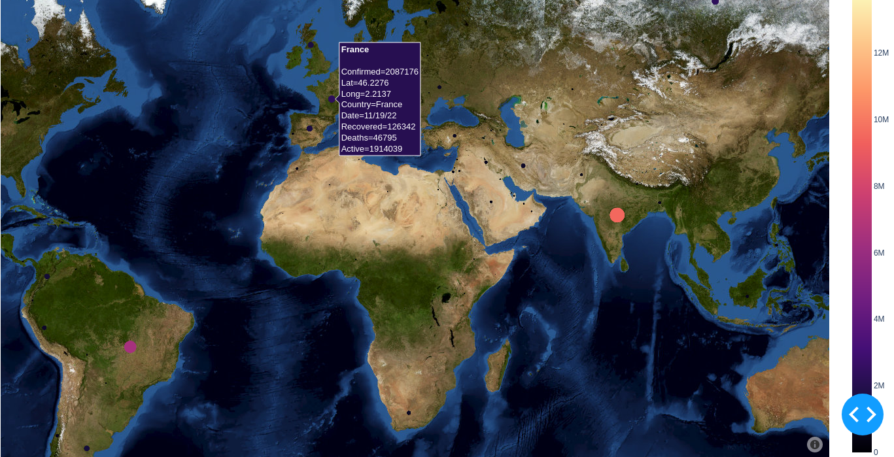
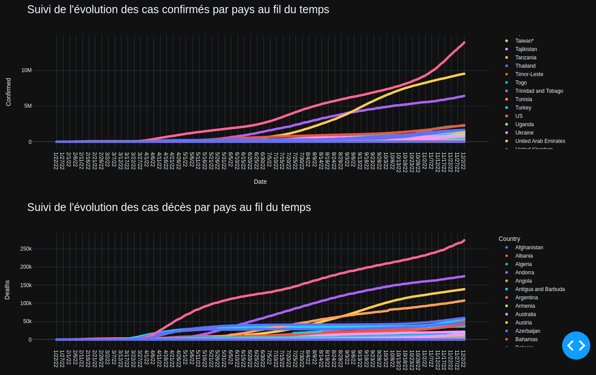
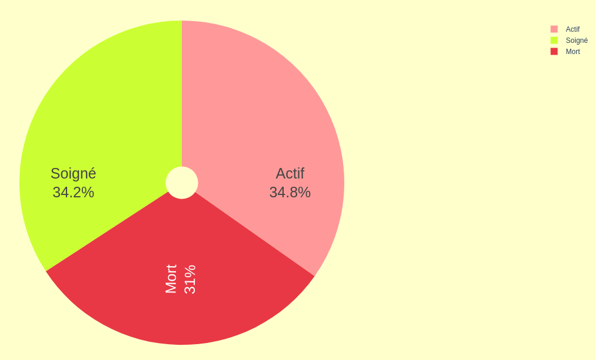
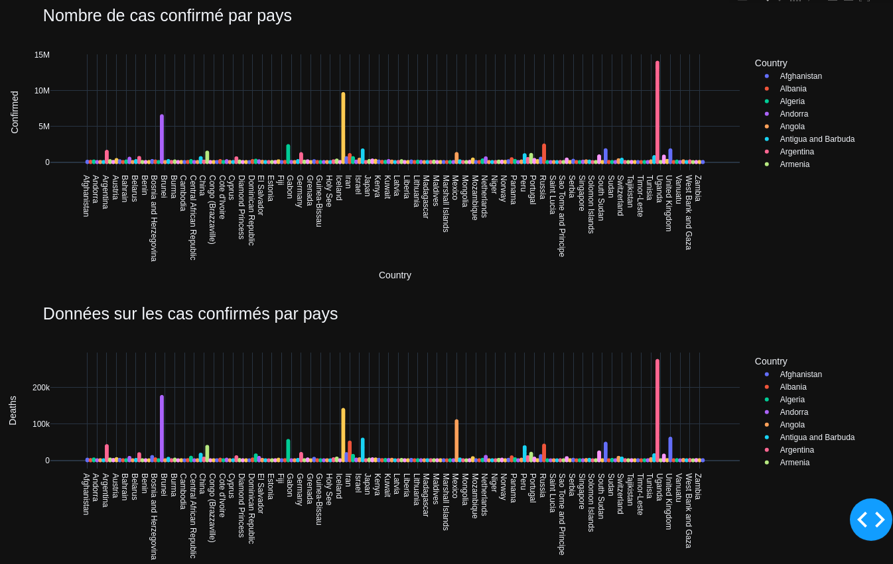
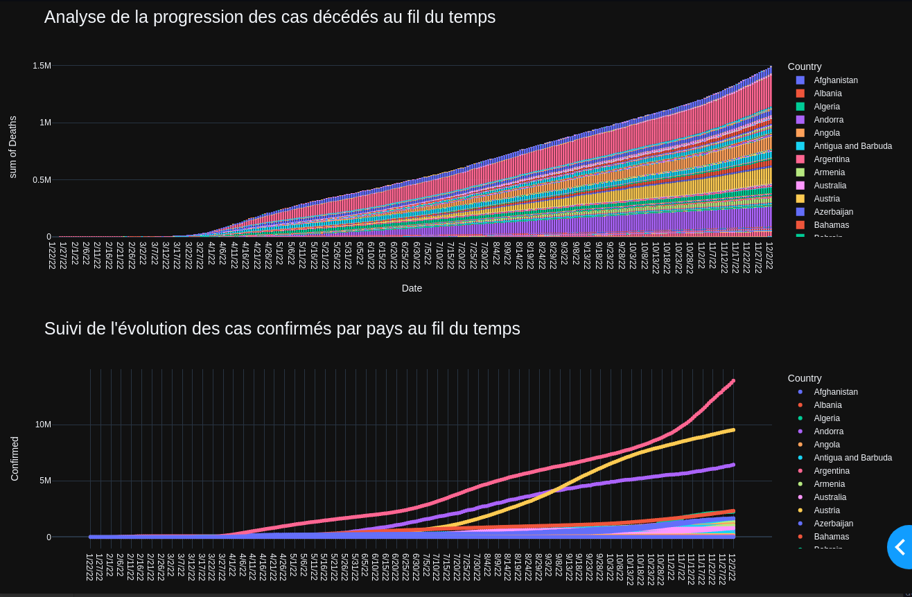

# ESIEE PROJET PYTHON

-----------------

##### Charles BATCHAEV
E3FI

**Guide d'utilisateur :**

Une fois le projet cloné, il suffit d’exécuter `install-library.sh` pour télécharger les librairies nécessaire afin
de faire fonctionner le code. Pour executer le fichier, il suffit se rendre dans le dossier et executer le fichier "traitement_data.py".

Les librairies utilisées : `pip install dash; pip install plotly-express; pip install plotly; pip install pandas.`

Rapport : 

J'ai choisi le sujet du COVID-19 dans le monde depuis le début de l'année 2020. J'ai recueilli les données sur le site officiel "Johns Hopkins Center for Systems Science and Engineering", qui regroupe les données sur le COVID-19 en temps réel depuis le début de la pandémie. Le lien qui mène au site des données que j'ai choisi est le suivant : https://data.humdata.org/dataset/novel-coronavirus-2019-ncov-cases. On y trouve un grand nombre de données cas covid sur différents continents, ainsi que des données générales sur tous les pays.
Les données sont organisées en 9 colonnes : Date, Country, Latitude, Longitude, Soignés, Décès, Active.

Afin d'avoir une vision globale sur l'évolution du covid, j'ai choisi un graphique animé qui permet d'avoir un aperçu sur l'évolution des cas confirmés sur la période du début de l'année jusqu'à la fin. Pour l'animer on peut appuyer sur le bouton démarrer.

Étant donnée que tous les membres de ma famille sont tombées malade récemment, et ce pour la 3ème fois. Je me suis pourquoi ne pas analyser le taux de covid dans le monde en 2022, pour voir si covid est aussi présent dans les autres pays. 

En France, le taux de personnes atteint par COVID pour l'année 2022 est aussi important, je vous laisse l'aperçu ci-dessus. 

D'après les résultats on voit que, comme depuis le début du covid en 2020, les États-Unis sont en tête du classement dans le nombre de cas confirmés et récencés par rapport aux autres pays. Ils ont aussi le plus grand nombre de cas de décès dans le monde. 

Pour cette fin d'année on voit que dans le monde il y a plus de personnes soignées que décédées. 

Un aperçu général sur le nombre de décès et le nombre de cas confirmés dans le monde selon les pays.

## Organisation du code :

Le code est organisé en 2 parties  :

-  La premiere partie partie où on déclare les graphes qu'on souhaite faire apparaitre sur dashboard
-  Deuxième partie, nous créons le dashboard en lui même dans lequel on organise l'affichage des figures.
  Pour ajouter des éléments au dashboard, il est nécessaire de déclarer de nouvelles figures dans la première partie du code, puis de les inclure dans la déclaration du dashboard.

## Ressources utilisées :

- Cours de python  
-  https://data.humdata.org/dataset/novel-coronavirus-2019-ncov-cases
